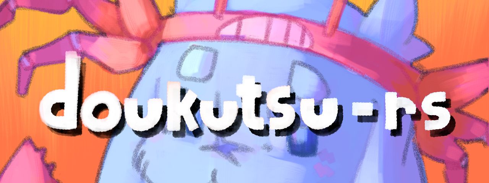

A fully playable re-implementation of the Cave Story (Doukutsu Monogatari) engine written
in [Rust](https://www.rust-lang.org/).

[Join the Discord server](https://discord.gg/fbRsNNB)

- [Get nightly builds](https://nightly.link/doukutsu-rs/doukutsu-rs/workflows/ci/master?preview) (recommended for now, has latest fixes and improvements)

  Permalinks to latest builds from `master` branch:

  - [Windows (64-bit)](https://nightly.link/doukutsu-rs/doukutsu-rs/workflows/ci/master/doukutsu-rs_windows-x64.zip)
  - [Windows (32-bit)](https://nightly.link/doukutsu-rs/doukutsu-rs/workflows/ci/master/doukutsu-rs_windows-x32.zip)
  - [macOS (Intel, 64-bit, 10.14+)](https://nightly.link/doukutsu-rs/doukutsu-rs/workflows/ci/master/doukutsu-rs_mac-x64.zip)
  - [macOS (Apple M1, 11.0+)](https://nightly.link/doukutsu-rs/doukutsu-rs/workflows/ci/master/doukutsu-rs_mac-arm64.zip)
  - [Linux (64-bit)](https://nightly.link/doukutsu-rs/doukutsu-rs/workflows/ci/master/doukutsu-rs_linux-x64.zip)
  - [Android (armv7/arm64/x86)](https://nightly.link/doukutsu-rs/doukutsu-rs/workflows/ci/master/doukutsu-rs_android.zip)

- [Get stable/beta builds from GitHub Releases](https://github.com/doukutsu-rs/doukutsu-rs/releases)
  
> [!NOTE]
> macOS note: If you get a `"doukutsu-rs" can't be opened` message, right-click doukutsu-rs.app and click open.

> [!NOTE]
> If you get issues with Epic Games Store version, scroll down for instructions.

#### Data files

In order to work doukutsu-rs needs to be paired with supported data files. This repository does not contain any data
files.

doukutsu-rs works fine with freeware data files or [NXEngine(-evo)](https://github.com/nxengine/nxengine-evo) or from a
supported copy of [Cave Story+](https://www.nicalis.com/games/cavestory+).

  
How to set up data files on Android

  
  If your phone has an app called **"Files"**:

  1. Launch this app.
  2. Press **☰** on the top left corner.
  3. Tap on **"doukutsu-rs game data"**.
  4. Copy your game data files to the opened folder.

  If your phone does not have this app:
  
  1. Install the **"Material Files"** app from *Hai Zhang* and launch it([Google Play](https://play.google.com/store/apps/details?id=me.zhanghai.android.files) | [F-Droid](https://f-droid.org/en/packages/me.zhanghai.android.files/) | [Github Releases](https://github.com/zhanghai/MaterialFiles/releases)).
  2. Press **☰** on the top left corner.
  3. Press **"+ Add storage"**.
  4. In the window that pops up, press **"External storage"**.
  5. Press **☰** on the top left corner.
  6. Tap on **"doukutsu-rs game data"**.
  7. Press the large blue button at the bottom labelled **"USE THIS FOLDER"**.
  8. Then click on **☰** in the top left corner again and open.
  9. Tap on **"files"** above **"+ Add storage"**.
  10. Copy your game data files to the opened folder.

#### Supported game editions and data file acquisition guides

**Freeware**

doukutsu-rs works out of the box when it's placed in the same directory as the original Doukutsu.exe executable. On the initial
startup, doukutsu-rs will automatically extract the additional resources that are embedded in the vanilla game into the `data`
directory. Until that is done, both doukutsu-rs and the vanilla executable have to exist in the directory.

Example root directory

**Cave Story+**

doukutsu-rs can be used as drop-in replacement for `CaveStory+.exe`. No modifications to game files are needed.

**Original version (first released in 2011 on Steam)** - expand for instructions

Steam release (Win/Mac/Linux)

The `data` folder is in the same place across all platforms.

If you want to use doukutsu-rs as a substitute for Mac version of Cave Story+ (which at moment of writing doesn't work
on 10.15+ anymore), do the following:

1. Find the doukutsu-rs executable:
   - In AppVeyor builds, it's in `doukutsu-rs.app/Contents/MacOS/doukutsu-rs`
   - In your own builds, it's in `target/(release|debug)/doukutsu-rs`
2. Open Steam Library, select `Cave Story+`, press the `Manage` button (gear icon) and select `Properties...`
3. Select `Local Files` and press `Browse...`.
4. Open the `Cave Story+.app` bundle and navigate to `Contents/MacOS` directory.
5. Rename the `Cave Story+` executable to something else or delete it.
6. Copy the doukutsu-rs executable and rename it to `Cave Story+`.
7. Launch the game from Steam and enjoy!

>  [!WARNING]
> **EPIC GAMES STORE VERSION WARNING**
> 
> Nicalis for some reason ships a stray `opengl32.dll` DLL from Windows 7 with the Epic Games Store copies of Cave Story+.
> 
> However as the game is 32-bit and the dll is 64-bit it has no effect on the original version, but as it's a core Windows DLL and doukutsu-rs ships 64-bit builds and uses OpenGL, it's makes the game crash on startup.
> 
> The fix is to simply delete `opengl32.dll`, as it's not used anyway.

Epic Games Store

Check your default installation directory.

GOG

Check your default installation directory.

Humble Bundle

The archive from Humble Bundle contains the necessary `data` folder, in the same folder as `CaveStory+.exe`.

WiiWare

1. [Dump Your WiiWare `.wad`](https://wii.guide/dump-wads.html)
2. [Extract and decompress the `data` folder](https://docs.google.com/document/d/1hDNDgNl0cUDlFOQ_BUOq3QCGb7S0xfUxRoob-hfM-DY)
   Example of a [valid uncompressed `data` folder](https://user-images.githubusercontent.com/53099651/159585593-43fead24-b041-48f4-8332-be50d712310d.png)

**Remastered version (first released in 2017 on Switch)**

> [!NOTE]
> This version is **incompatible** with saves from the original version.
>
> Interchanging the save files may result in spawning in wrong locations, softlocks, graphical glitches, or other issues.

Nintendo Switch

Extract the `data` folder (contained in `romfs`) from your console using tool such as [nxdumptool](https://github.com/DarkMatterCore/nxdumptool).

**Important notes:**

- doukutsu-rs doesn't rely on the original ROM or executable, you just need the data files, go to `RomFS options` menu to just extract the files to SD card so you don't need to do any extra steps.
- Ensure you're dumping the files **with update included** (`Use update/DLC` option), as 1.0 isn't supported.

**Nintendo Switch homebrew port specific info**

If you're running the homebrew port (drshorizon.nro) on your Switch, you can avoid the dumping step, doukutsu-rs will
automatically detect and mount the data files if you run it over Cave Story+ in Title Override mode (hold `R` while starting CS+ and launch d-rs from hbmenu).

You can put your own data files in `/switch/doukutsu-rs/data` directory on SD Card, which will be overlayed over RomFS if
you run it in setup described above.

#### Controls

Same controls as the default for freeware and Cave Story+ keyboard.

To change, use the control customization menu or edit `doukutsu-rs\data\settings.json` within your user directory.

|                           | P1        | P2        |
| ------------------------- | --------- | --------- |
| Movement                  | `← ↑ ↓ →` | `, L . /` |
| Jump                      | `Z`       | `B`       |
| Shoot                     | `X`       | `N`       |
| Cycle Weapon              | `A and S` | `G and H` |
| Inventory / Skip cutscene | `Q`       | `T`       |
| Map                       | `W`       | `Y`       |
| Strafe                    | `LShift`  | `RShift`  |

- `Alt + Enter` - Toggle Fullscreen
- `F2` (While paused) - Quick Restart

#### Screenshots

Freeware

Original CS+

Remastered CS+

#### Credits

- Studio Pixel/Nicalis for Cave Story
- [AppleHair](https://github.com/AppleHair) - icon redesign for all platforms(`crabsue-icon`).
- [@Daedily](https://twitter.com/Daedliy) - brand artwork (Icon / Banner / Server), screenshots for this guide.
- [ggez](https://github.com/ggez/ggez) - parts of it are used in `crate::framework`, notably the VFS code.
- [Clownacy](https://github.com/Clownacy) - widescreen camera code.
- [LunarLambda for organism](https://github.com/doukutsu-rs/organism) - used as basis for our Organya playback engine.
- [Zoroyoshi](http://z.apps.atjp.jp/k12x10/) - k12x10 font we use as built-in font.
